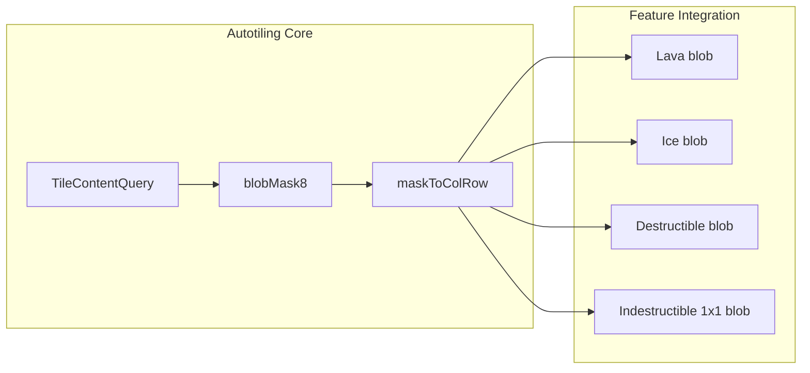

# Autotiling System (Wang Blob) – Implementation Plan

## Locked Decisions (from Section 8)

- **Ground**: Unchanged. Blobs are used only for terrain features that **overlay** the ground and need to connect together: lava, ice (water-like), destructible (rocks), indestructible 1x1 (rocks). No ground blob tilesets.
- **Blob variant**: Use **8-bit** (2-edge 2-corner Wang) with the **7×7 tile layout** from [assets/wang_blob.png](assets/wang_blob.png) for mask→(col, row) mapping.
- **Lava / ice**: **Single** shared assets: `lava_blob.png`, `ice_blob.png` (no per-biome).
- **Indestructible**: Only **1x1** uses blob; 2x2 and 3x3 keep current multi-cell sprites.
- **TileContentQuery**: **New class** (not extend MinimapTileQuery), used by both MinimapTileQuery and ChunkManager; MinimapTileQuery maps content type → existing TileContentResult.
- **Chunk borders**: TileContentQuery is **deterministic** (seed, worldState, difficulty, biomePreset only); neighbor content is always computable without loading other chunks.

---

## Current State

- **Tiles**: [Tile.ts](src/world/Tile.ts) – each cell is a Tile actor with `kind`: ground, ice, base, etc. Ground uses a **random** 4x4 sprite index from [TerrainGraphics](src/world/TerrainGraphics.ts) (hash-based). No change planned for ground.
- **Obstacles/hazards**: [ChunkManager](src/world/ChunkManager.ts) places per-tile actors: [DestructibleObstacle](src/entities/DestructibleObstacle.ts), [IndestructibleObstacle](src/entities/IndestructibleObstacle.ts), [LavaPool](src/hazards/Hazards.ts). Each uses a **random** sprite index. Autotiling will replace that with neighbor-based blob index for these overlay features.
- **Assets**: [terrainAssets.ts](src/resources/terrainAssets.ts) and `public/assets/terrain/` – existing ground, destructible, indestructible; no blob layouts yet.
- **Deterministic query**: [MinimapTileQuery](src/world/MinimapTileQuery.ts) provides deterministic `getTileContent(gx, gy)` for minimap; a new **TileContentQuery** will provide full content type for autotiling and ChunkManager.

## Architecture Overview




- **TileContentQuery**: Single source of truth for “what’s at (gx, gy)” (base, ground, ice, lava, resource, destructible, indestructible). Used by ChunkManager, autotiling, and (via mapping) MinimapTileQuery.
- **Autotiling core**: 8-bit neighbor mask (2-edge 2-corner Wang) and mapping to tile (col, row) using the **7×7 layout** defined by the template [assets/wang_blob.png](assets/wang_blob.png). No game-specific content logic—only “given a predicate, compute mask” and “given mask, get sprite from 7×7 sheet”.
- **Features**: Lava, ice, destructible, indestructible (1x1 only) each define “same type”, call the core, and apply the correct sprite from their blob sheet (same 7×7 layout as template).

## 1. Tile Content Model (deterministic, chunk-agnostic)

- **Goal**: For any (gx, gy), compute a single “content type” that matches what ChunkManager would place, so blob neighbor checks are correct at chunk edges without loading neighbors.
- **Implementation**: New **TileContentQuery** class (separate from MinimapTileQuery) that encapsulates ChunkManager’s placement logic (probability bands, noise, `clearedTileKeys`, `getDepositAtTile`, indestructible block occupancy). ChunkManager and autotiling both use it.

**Content type:**

- `base` (0,0 only)
- `ground`
- `ice`
- `lava`
- `resource` (iron/crystal deposit; gas separate if needed)
- `destructible`
- `indestructible` (cell is origin of a block or covered by one)

**Indestructible occupancy**: For (gx, gy) to be “rock”, the query must consider all block origins that could cover (gx, gy) (e.g. (gx, gy), (gx-1, gy), (gx-2, gy), (gx, gy-1), (gx, gy-2), (gx-1, gy-1), …) and determine if any would place a block covering that cell. Deterministic from seed and worldState.

MinimapTileQuery can call TileContentQuery and map content type → existing `TileContentResult` (resource, hazard) so the minimap stays unchanged.

## 2. Autotiling Core (reusable, 7×7 Wang template)

- **Location**: New module, e.g. `src/world/autotiling/` or `src/autotiling/`.
- **Wang blob template**: The canonical layout and mask→tile mapping are defined by [assets/wang_blob.png](assets/wang_blob.png):
  - **Grid**: 7 columns × 7 rows (49 tile cells), 0-indexed `(col, row)`.
  - **SpriteSheet**: Load blob assets with `grid: { rows: 7, columns: 7, spriteWidth: TILE_SIZE, spriteHeight: TILE_SIZE }`.
  - Each cell in the template is labeled with the 8-bit mask value (0–255) that selects that tile. Implementation must provide a lookup **mask → (col, row)** that matches this template (e.g. a constant table `MASK_TO_TILE[mask] = { col, row }[]` derived from the template). Not every mask 0–255 need map to a unique cell; the template defines which mask values point to which (col, row).
  - A mask value can map to more than one cell. If there are more than one cell mapping, for the mask value, deterministically select a random cell to use for that coordinate.
- **8-bit blob mask (2-edge 2-corner Wang)**  
  - Eight neighbors: N, NE, E, SE, S, SW, W, NW.  
  - **Bit convention** (clockwise from North, matching the template):
    - N = 1, NE = 2, E = 4, SE = 8, S = 16, SW = 32, W = 64, NW = 128.
    - Layout:

```
      NW (128)   N (1)   NE (2)
      W  (64)   [Tile]   E  (4)
      SW (32)    S (16)  SE (8)
      

```

- Diagonal bits (NE, SE, SW, NW) are only set when **both** adjacent cardinals are “same type” (e.g. NE only if N and E are same), so the effective combinations are a subset of 0–255.
- `blobMask8(gx, gy, sameType: (gx, gy, nx, ny) => boolean): number` returns the 8-bit value; then use the template-derived lookup to get `(col, row)`.
- **Sprite application**: Given an ImageSource (or SpriteSheet) for a blob tileset (7×7 grid, same layout as template), tile size TILE_SIZE, and mask, look up (col, row) and use `sheet.getSprite(col, row)` to get or apply the sprite.

No game-specific content in the core—only “given a predicate, compute 8-bit mask”, “mask → (col, row) from template”, and “apply sprite by (col, row) from 7×7 sheet”.

## 3. Feature Integration (overlay features only)

- **Ground**: **No blob.** Ground keeps current random 4x4 sprite selection. No ground_blob assets or blob logic for ground.
- **Ice**: Tile kind ice; “same type” = ice. Use TileContentQuery for neighbor check, blobMask8, then sprite from **single** `ice_blob.png` (7×7, same layout as template).
- **Lava**: One LavaPool per lava tile; “same type” = lava. Compute blob mask at creation, apply sprite from **single** `lava_blob.png` (7×7).
- **Destructible**: “Same type” = destructible at that cell. One sprite per tile from `destructible_blob_<biome>.png` (7×7, per biome).
- **Indestructible**: Only **1x1** uses blob; “same type” = cell has indestructible (origin or part of block). Use `indestructible_blob_<biome>.png` (7×7). 2x2 and 3x3 keep current multi-cell sprites unchanged.

## 4. ChunkManager and Rendering Changes

- **Order of operations**: Two-phase per chunk: (1) Fill a temporary grid with `TileContentType` for chunk + 1-tile border using TileContentQuery. (2) Iterate and create Tile/obstacle/lava actors; for each overlay feature, compute 8-bit blob mask from that grid, look up (col, row) from the template mapping, then apply sprite from the 7×7 blob sheet.
- **Tile**: Ground tiles unchanged. For **ice** tiles, pass blob (col, row) from grid + autotiling core and apply sprite from `ice_blob.png`.
- **LavaPool**: Create with blob (col, row) from grid; apply sprite from 7×7 `lava_blob.png`.
- **DestructibleObstacle / IndestructibleObstacle**: Blob (col, row) from grid; apply sprite from respective 7×7 blob sheet. Indestructible: only 1x1 uses blob; 2x2/3x3 unchanged.

## 5. Filesystem and Tileset Organization

Layout under `public/assets/terrain/` (no ground blob):

```
public/assets/terrain/
├── ground_<biome>.png              # existing; unchanged
├── lava_blob.png                   # 7×7 blob (same layout as template)
├── ice_blob.png                   # 7×7 blob (single asset)
├── destructible_<biome>.png        # existing
├── destructible_blob_<biome>.png  # 7×7 blob, per biome
├── indestructible_<biome>_1x1.png # existing
├── indestructible_<biome>_2x2.png # existing
├── indestructible_<biome>_3x3.png # existing
└── indestructible_blob_<biome>.png # 7×7 blob for 1x1 only, per biome
```

- **Convention**: Each blob asset uses the **same 7×7 grid layout** as the reference template [assets/wang_blob.png](assets/wang_blob.png): 7 columns × 7 rows, sprite size TILE_SIZE (32px). The template defines which 8-bit mask value corresponds to which (col, row); all blob tilesets (lava, ice, destructible, indestructible) use the same logical layout so the same mask→(col, row) lookup applies to every blob sheet.

## 6. Tilesets to Add (summary)


| Feature        | New assets                            | Notes                         |
| -------------- | ------------------------------------- | ----------------------------- |
| Lava           | `lava_blob.png`                       | 7×7 (template layout), single |
| Ice            | `ice_blob.png`                        | 7×7 (template layout), single |
| Destructible   | `destructible_blob_<biome>.png` × 6   | 7×7, per biome                |
| Indestructible | `indestructible_blob_<biome>.png` × 6 | 7×7, 1x1 only, per biome      |


**Total new tilesets**: 1 + 1 + 6 + 6 = **14 new images** (lava, ice, destructible_blob × 6 biomes, indestructible_blob × 6 biomes). Ground has no blob assets.

## 7. Loader and TerrainResources

- In [terrainAssets.ts](src/resources/terrainAssets.ts) (or a sibling), add ImageSource entries for each new blob asset; expose via TerrainResources or a dedicated `BlobTerrainResources`.
- Ensure the loader includes these in getAllTerrainImageSources() (or equivalent) so they load before the planet scene.

## 8. Implementation Order

1. **TileContentQuery** – Content type enum + deterministic query (including indestructible occupancy). Unit-test against ChunkManager for a few (gx, gy). Wire MinimapTileQuery to use it and map to TileContentResult.
2. **Autotiling core** – `blobMask8` (with 2-edge 2-corner diagonal rules). **Mask → (col, row)**: implement lookup table that matches [assets/wang_blob.png](assets/wang_blob.png) (each cell in the 7×7 template is labeled with the mask value that selects that tile). Generic “apply blob sprite” helper: given mask, look up (col, row), then `sheet.getSprite(col, row)`.
3. **Assets** – Add one 7×7 blob tileset (e.g. lava) as placeholder; wire path in terrainAssets. All blob sheets use grid `{ rows: 7, columns: 7 }` and the same mask→(col, row) mapping as the template.
4. **Lava** – Integrate: ChunkManager two-phase grid + blob mask → (col, row), LavaPool uses sprite from `lava_blob.png`.
5. **Ice** – Tile kind ice uses blob sprite from `ice_blob.png` via mask→(col, row).
6. **Destructible** – DestructibleObstacle uses `destructible_blob_<biome>.png` via mask→(col, row).
7. **Indestructible 1x1** – Use `indestructible_blob_<biome>.png`; 2x2/3x3 unchanged.
8. **Minimap** – Ensure MinimapTileQuery (using TileContentQuery under the hood) still returns correct resource/hazard for drawing.

## 9. SOLID and Reusability

- **Single responsibility**: Core = 8-bit mask math + mask→(col, row) from template; TileContentQuery = “what is at (gx, gy)”; each feature = “same type” predicate + asset choice.
- **Open/closed**: New overlay features (e.g. “water”, “mud”) add a content type, a “same type” use of TileContentQuery, and a 7×7 blob sheet (same layout as template) without changing the core.
- **Dependency inversion**: ChunkManager and rendering depend on TileContentQuery and an autotiling helper that takes a predicate; they don’t contain blob bit logic.
- **Reusable**: Any feature with a tile grid and “same type” can use `blobMask8` and the template-based mask→(col, row) lookup.

---

**Summary**: Introduce a deterministic **TileContentQuery** and an autotiling core using **8-bit blob mask** and the **7×7 tile layout** from [assets/wang_blob.png](assets/wang_blob.png). Bit order: N=1, NE=2, E=4, SE=8, S=16, SW=32, W=64, NW=128. Mask→(col, row) is defined by the template (each cell shows the mask that selects it). Use blobs only for **overlay** features: lava, ice, destructible, and indestructible 1x1. **Ground stays as-is.** Single 7×7 assets for lava and ice; per-biome 7×7 blob sheets for destructible and indestructible. ChunkManager uses a two-phase pass (content grid then actors with blob sprite by mask lookup). Total 14 new blob tilesets; no ground blob.