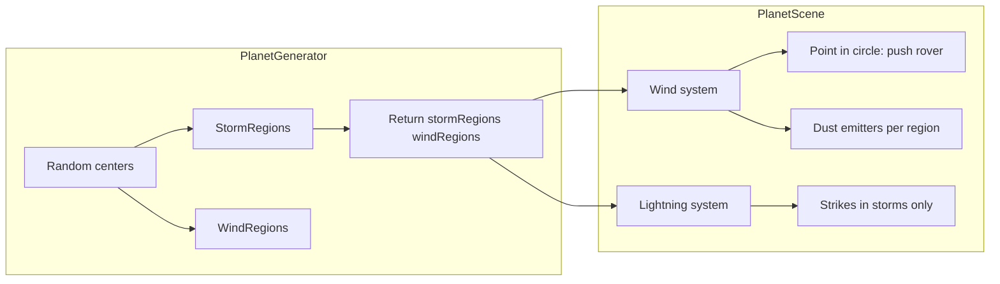

# Lightning storm regions and wind as large areas

## Overview

Replace per-tile lightning and wind with **large circular regions** (storm regions and wind regions). **Storms** always contain both lightning and wind; **wind** can also occur independently in wind-only regions. Storm regions have a subtle translucent overlay, move slowly, and host lightning strikes (warning → flash/shake/thunder/damage). Wind regions (and the wind inside storms) push the rover in a single fixed direction per region and use **subtle dust particles** moving in the wind direction, with particle speed proportional to wind strength.

---

## Current state

- **[Hazards.ts](src/hazards/Hazards.ts)**: `LightningZone` (fixed 40×40, one-shot); `WindZone` (rectangular, collision-based, ambient emitter with wide angle spread; push in `direction`; rotation animation).
- **[PlanetGenerator.ts](src/world/PlanetGenerator.ts)**: Storm tiles place both `WindZone` and `LightningZone` at same cell; `STORM_ZONE_DENSITY`, `placeHazard(stormCount, …)`.
- **[Particles.ts](src/effects/Particles.ts)**: `createAmbientEmitter` for lava/wind; particles have min/max speed and angle range.
- **Rover**: `windResist`, `takeDamage(..., "lightning")`, `lightningWarningTime`, `lightningDamageReduction` already exist.

---

## 1. Config and types

**File: [src/config/gameConfig.ts](src/config/gameConfig.ts)** (or `stormConfig.ts` / wind constants)

**Storm regions (lightning):**

- `STORM_REGION_COUNT`, `STORM_REGION_RADIUS_PX`, `STORM_MOVE_SPEED`
- **Lightning strike rate**: A **configurable value** where **higher = lightning can occur more frequently**. Strikes occur **randomly** in time (not at a regular interval). Expose a single number that means “how often” (e.g. `LIGHTNING_STRIKE_RATE`: higher = more frequent). Under the hood: when scheduling the next strike, set `nextStrikeAt = now + randomDelay`, where `randomDelay` is chosen randomly from a distribution (e.g. uniform in `[0.5 * mean, 1.5 * mean]` or exponential) so timing feels random; derive the mean delay from the rate (e.g. if rate is “strikes per minute”, mean interval = 60000/rate; if rate is 0–1 intensity, map to a mean interval range). Difficulty multiplies the rate or reduces mean interval so harder = more frequent.
- `LIGHTNING_BASE_WARNING_MS`, `LIGHTNING_STRIKE_RADIUS_PX`, `LIGHTNING_DAMAGE`
- `LIGHTNING_WARNING_VISUAL_RADIUS_MULTIPLIER`: e.g. 1.1 so the warning/damage circle is drawn slightly larger than the actual damage radius for fairness.
- Lightning strike **rate** (mean interval or frequency) and optionally base warning time are scaled by **difficulty** (see [difficulty.ts](src/config/difficulty.ts)); harder modes = more frequent strikes / less warning.

**Wind regions (shared and wind-only):**

- `WIND_REGION_COUNT`: number of **wind-only** circles (independent of storms).
- `WIND_REGION_RADIUS_PX`: radius of wind circles (e.g. same order as storm radius, or slightly larger).
- `WIND_MOVE_SPEED`: slow drift (e.g. same or similar to storms).
- `WIND_PUSH_STRENGTH`: base force applied to rover per second when inside (e.g. 500–700 to match current feel); rover’s `windResist` reduces this.
- **Storm = wind + lightning**: Each storm region also applies wind (same push and direction logic) inside its circle; use same `WIND_PUSH_STRENGTH` and a single random direction per storm.
- **Wind strength variance**: Each region (wind or storm) gets a random multiplier to push strength (e.g. 0.8–1.2) so not every wind feels identical. Apply when creating regions.
- **Wind stacking cap**: When the rover is in multiple wind/storm circles, apply each push but **cap total wind acceleration per frame** (e.g. `WIND_MAX_ACCEL_PER_FRAME` or derived from max single push). Prevents uncontrollable stacking.

World bounds and base safe radius: use existing `PLANET_*_TILES`, `TILE_SIZE`, `BASE_SAFE_RADIUS_TILES`. **Storms can drift over the base** — no clamp to keep storm centers out of base; returning to base can become a “run through the storm” moment.

---

## 2. Wind region actor (circle + movement + wind logic)

**New: [src/hazards/WindRegion.ts](src/hazards/WindRegion.ts)** or add to Hazards.ts

- **WindRegion**: Actor for one circular wind area.
  - **Props**: `x, y` (world center), `radius`, `directionAngle` (radians, fixed for this region), `pushStrength` (base × random multiplier 0.8–1.2 per region), `moveSpeed` (for drift).
  - **Movement**: Same as StormRegion — update position by velocity each frame; wrap or clamp to world bounds; optionally change direction on edge. **Storms (and wind regions) can drift over the base**; no special clamp to keep storm center out of base safe zone.
  - **Rover push**: In scene or in actor: each frame, if rover position is inside circle (`distance(rover.pos, this.pos) <= radius`), apply `direction * pushStrength * (1 - rover.windResist) * (delta/1000)` to rover velocity (same formula as current WindZone).
  - **No collision body needed** for wind; use point-in-circle check. Optionally use a passive collision body for compatibility; plan assumes point-in-circle in scene or in a single “wind system” that iterates regions.
  - **Visual**: **Subtle tint** for wind-only regions (e.g. light gray at alpha ~0.08) so players can read “dust + tint = wind” vs “dark overlay + dust = storm (lightning risk).” Keeps wind zones noticeable for route planning without being as loud as storms.
  - **Particles**: See §5 — dust particles in wind direction, speed proportional to strength.

**Storm region (existing plan):**

- **StormRegion**: Circle with translucent overlay, movement, `containsWorldPoint`, `getRandomPointInside`. Does **not** by itself apply wind; the scene or a “wind system” will consider both WindRegions and StormRegions when applying wind (storms contribute wind inside their circle with the storm’s fixed direction and push strength).

---

## 3. Storm region actor (unchanged from prior plan)

**New: [src/hazards/StormRegion.ts](src/hazards/StormRegion.ts)**

- **StormRegion**: Circle with subtle translucent overlay (e.g. dark blue/gray, alpha ~0.25), slow movement, bounds handling. **Can drift over the base** (no clamp to keep center out of base safe zone).
- Expose `containsWorldPoint(wx, wy)`, `getRandomPointInside()`, and for wind: `getCenter()`, `getRadius()`, and a **wind direction and strength** (e.g. `windDirectionAngle`, `windPushStrength`; strength = base × random 0.8–1.2) so the wind system can push the rover when inside a storm.
- Lightning system schedules strikes only inside storm circles; strike sequence includes warning ramp-up, visual 1.1× radius, boundary-inclusive damage check, distance-scaled flash and thunder.

---

## 4. Storm–wind relationship

- **Storms always contain wind**: Each StormRegion has a fixed `windDirectionAngle` and uses `WIND_PUSH_STRENGTH`. When the rover is inside a storm circle, the wind system applies the same push as for WindRegion (single direction, resist applied).
- **Wind can occur without storms**: WindRegion instances are separate; they are placed at random (avoiding base), move slowly, and only push the rover + show dust. No lightning.
- **Generator**:
  - Create `STORM_REGION_COUNT` StormRegions (random center, avoid base; each with overlay, movement, and wind direction/strength).
  - Create `WIND_REGION_COUNT` WindRegions (random center, avoid base; movement, wind direction/strength).
  - Remove all per-tile WindZone and LightningZone placement (no more `placeHazard(stormCount, ...)` for wind/lightning).
- **Single wind application**: In PlanetScene (or a small WindSystem), each frame: for each WindRegion and each StormRegion, if rover is inside the circle, compute push `direction * pushStrength * (1 - windResist) * (delta/1000)` and add to an accumulator; then **cap total wind acceleration** for the frame (e.g. clamp magnitude to `WIND_MAX_ACCEL_PER_FRAME` or similar) before applying to rover velocity. Same per-region formula; stacking is capped so overlapping regions don’t make control impossible.

---

## 5. Wind visual: dust particles (direction + strength)

**Current**: WindZone uses `createAmbientEmitter` with a wide angle spread and rotation on the zone.

**New behavior**: Replace with **subtle particles that float in the direction of the wind** (dust being blown), with **velocity proportional to wind strength**.

- **Emitter placement**: For each WindRegion and each StormRegion, add a **continuous** particle emitter (or one per region) that:
  - Spawns particles within the circle (e.g. emitter at center with radius = region radius, or random position within circle each emit).
  - Particle **direction**: Aligned to the wind direction for that region (`minAngle`/`maxAngle` narrow around `windDirectionAngle`, e.g. ±0.2 rad).
  - Particle **speed**: Proportional to wind strength (e.g. `minSpeed = 0.3 * pushStrength`, `maxSpeed = 0.6 * pushStrength` in px/ms or equivalent so particles drift visibly). Tune so it looks like dust, not bullets.
  - **Appearance**: Small, semi-transparent (e.g. gray/beige), short lifetime, fade out — “dust”.
- **Implementation**: Reuse `createAmbientEmitter` in [Particles.ts](src/effects/Particles.ts) with a narrow angle range and speed derived from `pushStrength`. Add the emitter as a child of WindRegion or StormRegion (so it moves with the region), or attach to the same actor that draws the wind circle. For StormRegion, the storm overlay is separate (translucent circle); the dust emitter is the wind visual inside that circle.
- **Remove**: Old WindZone rotation animation and old emitter angle spread; no more rectangular wind zones.

---

## 6. Lightning strike system

- Scene-level state: `pendingStrikes[]`, `nextStrikeScheduledAt`. **Strikes occur randomly in time**: when it’s time to schedule the next strike, set `nextStrikeScheduledAt = now + randomDelay`, where `randomDelay` is derived from the configurable rate (e.g. mean interval in ms); higher rate = smaller mean delay = more frequent strikes. No fixed interval — each gap is random. Rate is scaled by difficulty (harder = more frequent); optionally base warning time is reduced on harder difficulties.
- Schedule strikes only inside **StormRegions** (random storm, random point inside); **global rate** (strikes can be scheduled even when rover is not in a storm).
- **Warning ramp-up**: Short “charge” phase (e.g. 200–400 ms) before the main warning: show a dimmer or smaller circle first, then the full warning circle for `LIGHTNING_BASE_WARNING_MS + roverStats.lightningWarningTime`. Softens pop-in and draws the eye gradually.
- **Strike radius clarity**: Draw the warning and strike circle at **visual radius = LIGHTNING_STRIKE_RADIUS_PX × LIGHTNING_WARNING_VISUAL_RADIUS_MULTIPLIER** (e.g. 1.1×). **Damage** uses the actual `LIGHTNING_STRIKE_RADIUS_PX` (rover center in circle, **boundary counts as inside** for a consistent grace rule). So “just outside the drawn circle” never takes damage.
- Resolve: **Damage** if rover center is inside or on the damage-radius circle (include boundary). Then: screen flash (intensity scales with distance — e.g. slightly dimmer when strike is far), camera shake, `playThunder(delayMs, volume)` with **delay and volume** both distance-based (distant = later and quieter; close = loud).
- Files: PlanetScene or [LightningSystem.ts](src/hazards/LightningSystem.ts), [sounds.ts](src/audio/sounds.ts) (`playThunder(delayMs?, volume?)`).

---

## 7. Generator changes (summary)

**File: [src/world/PlanetGenerator.ts](src/world/PlanetGenerator.ts)**

- **Remove**: `placeHazard(stormCount, ...)` that creates WindZone + LightningZone.
- **Add**: Create storm and wind regions using **difficulty-scaled counts** (e.g. `STORM_REGION_COUNT * mult.stormCount`, `WIND_REGION_COUNT * mult.windRegionCount`). Each region: random center (avoid base at spawn only; they may drift over base later), radius, move speed, wind direction + strength (base × random 0.8–1.2). StormRegions get overlay; WindRegions get subtle tint only.
- **Return**: `PlanetGenerationResult` extended with `stormRegions: StormRegion[]` and `windRegions: WindRegion[]`. PlanetScene stores these and passes to the lightning system and to the wind system (point-in-circle checks + push; dust emitters are children of each region).

---

## 8. Files to touch (summary)

| Area             | Files                                                                                                                                                                                                          |
| ---------------- | -------------------------------------------------------------------------------------------------------------------------------------------------------------------------------------------------------------- |
| Config           | [gameConfig.ts](src/config/gameConfig.ts) (storm + wind constants, visual radius multiplier, wind cap); [difficulty.ts](src/config/difficulty.ts) (storm count, wind count, strike interval, optional warning) |
| Storm region     | [StormRegion.ts](src/hazards/StormRegion.ts) or Hazards.ts (circle overlay, movement over base, wind direction/strength with variance, getRandomPointInside)                                                   |
| Wind region      | [WindRegion.ts](src/hazards/WindRegion.ts) or Hazards.ts (circle, subtle tint, movement over base, wind direction/strength with variance)                                                                      |
| Wind application | PlanetScene or [WindSystem](src/hazards/WindSystem.ts): point-in-circle, accumulate push, **cap total wind acceleration** per frame; windResist applied per region                                             |
| Wind particles   | [Particles.ts](src/effects/Particles.ts) — use createAmbientEmitter with narrow angle (wind direction) and speed ∝ strength; attach to WindRegion and StormRegion                                              |
| Lightning        | PlanetScene or LightningSystem.ts (random strike timing from configurable rate; difficulty-scaled rate; warning ramp-up; 1.1× visual radius; boundary-inclusive damage; distance-scaled flash, shake, thunder) |
| Thunder          | [sounds.ts](src/audio/sounds.ts) (`playThunder(delayMs?, volume?)` — distance-based delay and volume)                                                                                                          |
| Generator        | [PlanetGenerator.ts](src/world/PlanetGenerator.ts) (spawn storm + wind regions with difficulty-scaled counts and wind strength variance; remove per-tile wind/lightning)                                       |

---

## 9. Suggested implementation order

1. **Config**: Add storm and wind region constants (counts, radii, speeds, push strength, lightning params, `LIGHTNING_WARNING_VISUAL_RADIUS_MULTIPLIER`, `WIND_MAX_ACCEL_PER_FRAME`). Add **lightning strike rate** (e.g. mean time between strikes in ms; higher value in config = less frequent, or use a “frequency” where higher = more frequent) and **random delay** so each next strike is at `now + randomDelay(rate)`. Add difficulty multipliers for storm count, wind count, lightning strike rate (and optionally base warning time); wind strength variance (0.8–1.2 per region).
2. **WindRegion**: Circle actor, movement (can drift over base), expose direction + strength (base × random multiplier). **Subtle tint** (e.g. alpha 0.08) for wind-only visibility. **Wind application**: In PlanetScene/WindSystem, for each WindRegion and StormRegion, if rover in circle add push to accumulator; apply **capped** total wind acceleration per frame.
3. **StormRegion**: Circle actor, translucent overlay, movement (can drift over base); wind direction/strength (with variance), `getRandomPointInside`. Wind application as above.
4. **Generator**: Spawn wind-only and storm regions (use difficulty for counts); remove old storm-tile wind/lightning placement.
5. **Dust particles**: Add dust emitter to WindRegion and StormRegion (direction = wind direction, speed ∝ push strength); remove old WindZone emitter/rotation.
6. **Lightning system**: Schedule strikes **randomly** (random time to next strike from configurable rate; higher rate = more frequent). Strikes only in storm circles; **difficulty-scaled** rate. **Warning ramp-up** (short charge phase then main warning). Draw warning/damage circle at visual 1.1× radius; **damage** uses actual radius, **boundary = inside**. Resolve: damage, **distance-scaled flash intensity**, shake, **thunder with distance-based delay and volume**.
7. **Polish**: Tune radii, speeds, particle speed vs strength, overlay opacity, wind cap.

---

## 10. Diagram

- **Storms** = overlay + lightning + wind (one direction per storm).
- **Wind-only** = wind (one direction per region) + dust; no overlay, no lightning.

---

## 11. Game design suggestions (expert pass)

These are optional improvements to make the mechanic more readable, fair, and decision-rich. Add only what fits the game’s tone and scope.

### Readability and telegraphing

- **Warning ramp-up**: Instead of the warning circle appearing only when the strike is scheduled, consider a short “charge” phase: e.g. 200–400 ms of a dimmer or smaller circle before the main warning, so the eye is drawn gradually. Keeps the current `lightningWarningTime` as the main dodge window but softens the pop-in.
  - Decision: Do this
- **Strike radius clarity**: Make the strike/warning circle slightly larger visually than the actual damage radius (e.g. draw at 1.1× radius) so “I was just outside the circle” feels fair. Alternatively keep visual = damage radius but use a crisp edge and high contrast so the boundary is unambiguous.
  - Decision: Do this
- **Wind-only vs storm**: Wind-only regions have no overlay, so they’re invisible except for dust. Consider a very subtle tint (e.g. light gray at 0.08 alpha) or a soft edge so players can learn “dust + tint = wind” and “dark overlay + dust = storm (lightning risk).” Prevents confusion without making wind zones as loud as storms.
  - Decision: Do this

### Agency and skill

- **Strike rate when rover is outside storms**: The plan schedules strikes only inside storm circles, but the rate is global. Consider: only schedule the next strike when the chosen strike position is inside a storm that currently contains the rover, or when the rover has been inside any storm recently. That way lightning doesn’t feel like it “fires into empty storm” when the player is elsewhere; the threat is tied to being in the storm. (If you prefer constant tension, keep global rate.)
  - Decision: keep global rate
- **Wind stacking cap**: If the rover is in two or more wind/storm circles, the plan applies each push. That can stack and feel uncontrollable. Options: (1) apply only the strongest single push, (2) cap total wind acceleration per frame, or (3) keep stacking but tune push strength down so two overlapping regions are challenging but not instant ejection. Document the choice in config.
  - Decision: cap total wind acceleration
- **Grace frame on lightning**: On the frame the strike resolves, if the rover is exactly on the edge, use “rover center in circle” with a consistent rule (e.g. include boundary). Avoid one-frame flicker where the player thinks they left in time but still take damage.
  - Decision: do this

### Pacing and tension

- **Storm movement and base**: Decide whether storms can drift over the base. If yes, returning to base can become a “run through the storm” moment. If no, clamp or deflect storm centers so they never overlap the base safe zone (current plan avoids placing storms in base vicinity at spawn but doesn’t forbid them moving over it later).
  - Decision: storms can drift over the base
- **Strike rate tuning**: Expose `LIGHTNING_STRIKE_INTERVAL_MS` (and optional variance) to difficulty so harder modes can increase frequency. Keeps the same mechanic but raises pressure.
  - Decision: lighting strike rates should be capped by the difficulty level
- **Wind as a path choice**: With large regions and slow movement, wind creates “do I cut through the wind or go around?” decisions. Ensure wind-only regions are visible enough (dust + optional subtle tint) so the player can plan routes. Stronger wind near storm edges (e.g. storm wind 1.2× push) could make storm approach feel more dangerous without changing lightning.

### Feedback and juice

- **Pre-strike crackle**: A very short, quiet crackle or static sound 100–200 ms before the strike sells “lightning about to hit” and rewards players who react to sound. Optional; can be a second, lighter call in `sounds.ts`.
  - Decision: don't do this yet
- **Thunder and distance**: You already have delay proportional to distance. Consider also reducing thunder volume with distance (distant strike = low rumble, close = loud) so the mix reinforces spatial awareness.
  - Decision: do this
- **Flash intensity**: Full-screen flash can be white or pale yellow; intensity could scale slightly with distance (e.g. 10% dimmer when strike is far) so a nearby strike feels more impactful. Subtle; only if you have a parameter for flash strength.
  - Decision: do this

### Risk and reward (optional)

- **Resources or objectives in storms**: If storms sometimes cover resource clusters or a path to a bonus, entering a storm is a deliberate risk (more resources, lightning danger) rather than pure punishment. Not required for the first version but increases meaningful choice.
- **Storm “eye”**: Optionally define a small inner radius (e.g. 30% of storm radius) where lightning never strikes (the “calm eye”). Players who learn this can use it for a brief respite; adds mastery and a reason to move toward storm center in some situations.

### Tuning and difficulty

- **Difficulty multipliers**: Add difficulty multipliers for: storm count, wind region count, lightning strike interval (or rate), and optionally base warning time (hard = less base warning). Document in difficulty config so balance is data-driven.
  - Decision: do this.
- **Wind strength variance**: Give each region a small random multiplier (e.g. 0.8–1.2) to push strength so not every wind feels identical; storms can use the same or a separate range.
  - Decision: do this.

### Summary of adopted decisions (now reflected in main plan)

- **Warning ramp-up**: Yes — short charge phase before main warning circle.
- **Strike radius clarity**: Yes — draw at 1.1× radius; damage uses actual radius, boundary counts as inside.
- **Wind-only tint**: Yes — subtle tint (e.g. alpha 0.08) so wind vs storm is readable.
- **Strike rate**: Keep global rate; strike interval (and optionally base warning) scaled by **difficulty**.
- **Wind stacking**: **Cap total wind acceleration** per frame (not strongest-only).
- **Grace frame**: Rover center in circle, include boundary.
- **Storms and base**: **Storms can drift over the base** (no clamp).
- **Thunder**: Distance-based **delay and volume** (close = loud, far = quiet).
- **Flash intensity**: Scale with distance (nearby strike = stronger flash).
- **Pre-strike crackle**: Not doing this yet (deferred).
- **Difficulty**: Multipliers for storm count, wind count, strike rate (and optionally base warning).
- **Wind strength variance**: Yes — per-region multiplier (e.g. 0.8–1.2).

